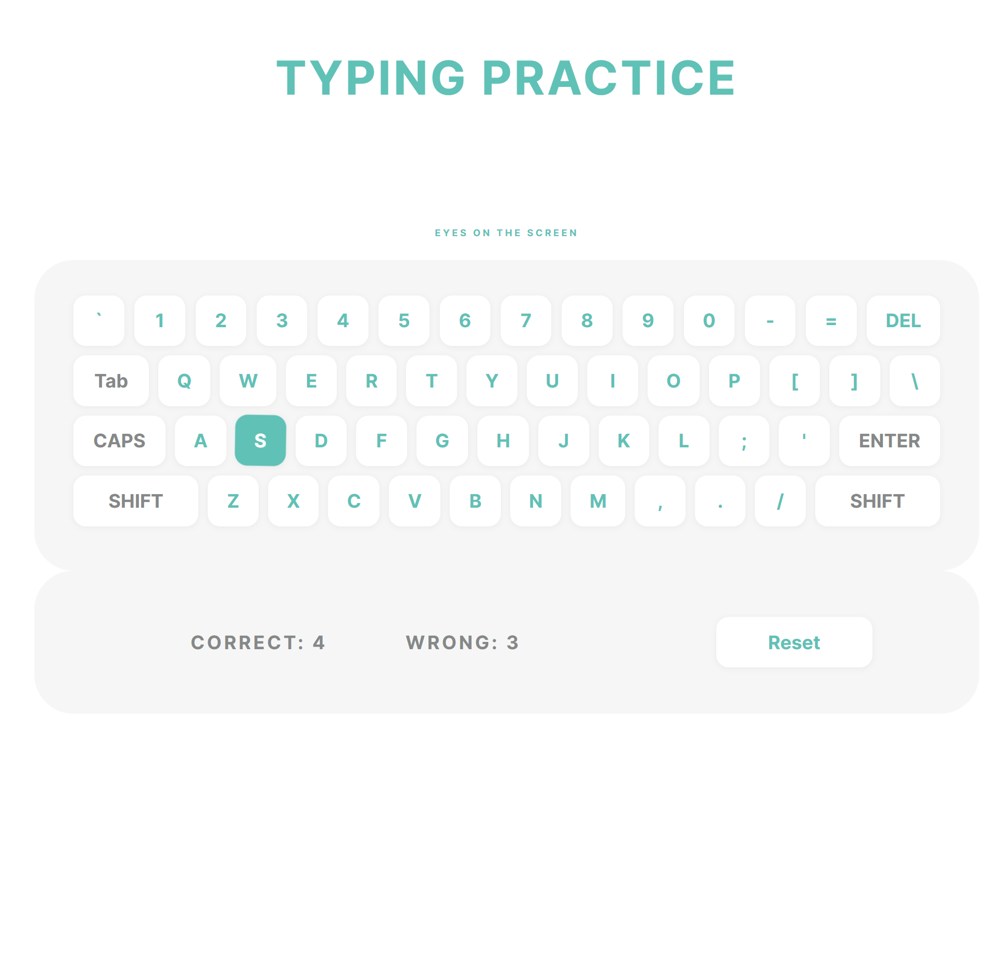

# TYPING PRACTICE

This short project is part of an advent calendar. The HTML and CSS files are provided and I created the JavaScript file.

On top of the initial exercice, there is now a count of the correct/wrong answers, and possibility to reset the count.

What score did you get?

## Screenshot

